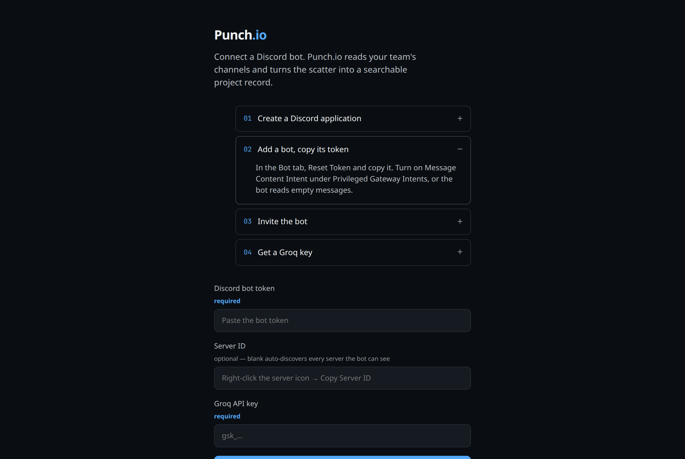
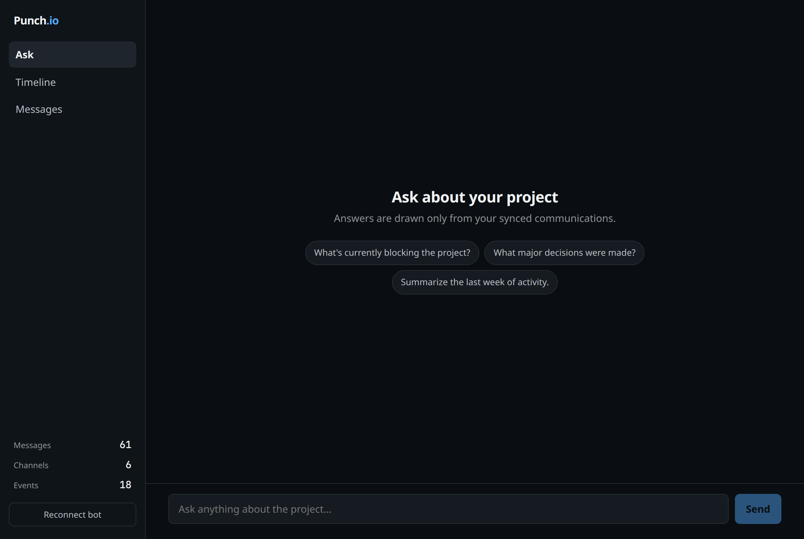
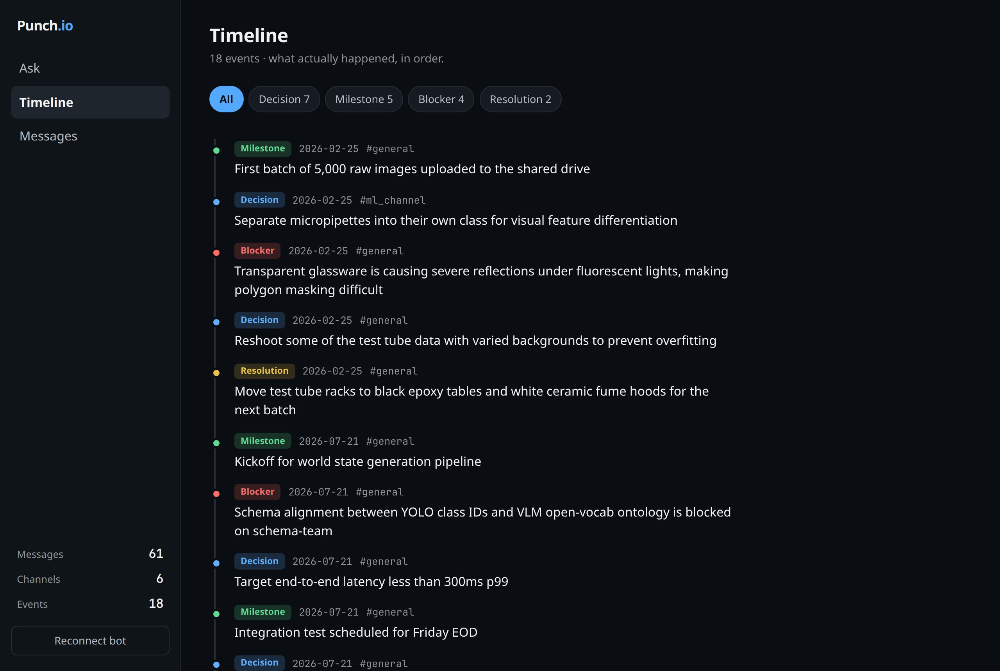
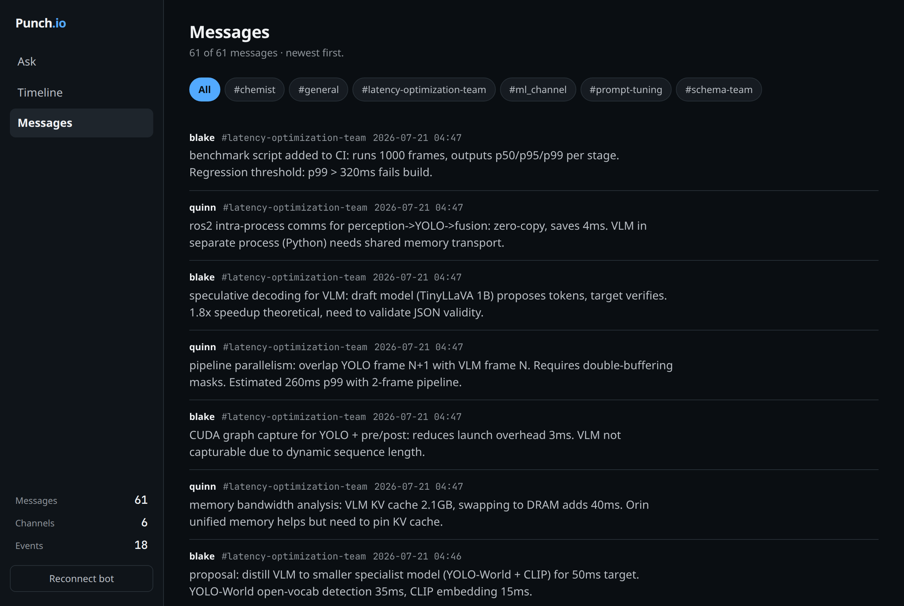

<p align="center">
  
</p>

<h1 align="center">Punch.io</h1>
<p align="center"><strong>Project Communication Intelligence</strong></p>

<p align="center">
  
  
  
  
</p>

Punch.io turns a team's Discord conversations into a searchable project record. It stores messages locally, builds a semantic search index, and uses Groq to answer questions with source messages attached.

The primary self-hosted interface is a React single-page app served by FastAPI. A Streamlit interface is included as a secondary local/demo interface.

## Features

- Discord bot onboarding and channel discovery
- Incremental Discord message sync
- AI-powered Q&A grounded in synced messages
- Source messages shown with each answer
- Message browsing and channel activity charts
- Timeline extraction for decisions, milestones, blockers, and resolutions
- Local SQLite message store and FAISS search index

<p align="center">
  
  
</p>
<p align="center"><em>Onboarding and bot connection flow</em> | <em>Ask questions and get grounded answers</em></p>

<p align="center">
  
  
</p>
<p align="center"><em>Extracted timeline of decisions and blockers</em> | <em>Browse synced messages by channel</em></p>

## Supported sources

| Source | React/FastAPI onboarding | Notes |
| --- | --- | --- |
| Discord | Supported | The end-to-end self-hosted flow documented below |
| Mattermost | Not supported in the UI | Connector/CLI code exists but is not part of the supported onboarding flow |
| Discourse | Not supported in the UI | Connector/CLI code exists but is not part of the supported onboarding flow |
| IMAP email | Not supported in the UI | Connector/CLI code exists but is not part of the supported onboarding flow |

For a self-hosting user, Discord is currently the only supported source from the web interface. The other connectors should be treated as experimental development code, not as production setup options.

## Requirements

- Python 3.13+
- [uv](https://docs.astral.sh/uv/getting-started/installation/)
- Node.js 18+ and npm
- A [Groq API key](https://console.groq.com/keys)
- A Discord application and bot

The first sync/build may download the Hugging Face `all-MiniLM-L6-v2` embedding model, so the host needs internet access initially. Runtime data is written locally under `data/`.

## Primary self-hosted setup: React + FastAPI

### 1. Install the project

```bash
git clone https://github.com/mekala-2405/Punch.io
cd Punch.io
uv sync
cd frontend
npm install
cd ..
```

### 2. Configure the Discord bot

Follow the [Discord bot setup](#discord-bot-setup) section before opening Punch.io. You will need the bot token and, optionally, the server ID.

### 3. Build the frontend

```bash
cd frontend
npm run build
cd ..
```

This creates `frontend/dist/`, which FastAPI serves in production. No `.env` file is required for this React onboarding flow: the onboarding form collects the Discord bot token, optional server ID, and Groq API key.

### 4. Start Punch.io

```bash
uv run uvicorn server:app --host 127.0.0.1 --port 8000
```

Open [http://localhost:8000](http://localhost:8000). The onboarding screen will:

1. Accept and validate your Discord bot token.
2. Discover the Discord servers and text channels the bot can access.
3. Sync the available messages.
4. Build the local SQLite and FAISS data.
5. Extract the project timeline.

The backend exposes `/api/onboard` for the initial Discord sync and `/api/ask` for Q&A. Generated frontend data is served from `/data`.

### Development mode (optional)

You only need two terminals when developing the React UI with Vite hot reload. Vite serves the browser app on port 5173, while FastAPI serves the API on port 8000.

Terminal 1:

```bash
uv run uvicorn server:app --host 127.0.0.1 --port 8000
```

Terminal 2:

```bash
cd frontend
npm run dev
```

Open [http://localhost:5173](http://localhost:5173). For normal self-hosting, use the production build above and run only FastAPI.

## Discord bot setup

### Create the application and bot

1. Open the [Discord Developer Portal](https://discord.com/developers/applications).
2. Select **New Application** and create an application.
3. Open the **Bot** page and create the bot.
4. Click **Reset Token**, copy the token, and keep it private.

### Enable message access

On the **Bot** page, enable **Message Content Intent** under **Privileged Gateway Intents**, then save. Without this intent, Discord can return messages with empty content.

### Invite the bot

1. Open **OAuth2 → URL Generator**.
2. Select the `bot` scope.
3. Grant the bot:
   - `View Channels`
   - `Read Message History`
4. Open the generated URL and add the bot to the target server.

If only some channels should be available, grant the bot access only to those channels. Punch.io can sync any text channel visible to the bot.

### Find the server ID

The server ID is optional in the React onboarding form. If you provide it, enable Discord **Developer Mode**, right-click the server icon, and select **Copy Server ID**. Leaving it blank lets Punch.io discover every server visible to the bot.

## Using Punch.io

After onboarding:

- **Ask**: ask questions such as `What is blocking the deployment?` or `Which decisions were made last week?`.
- **Timeline**: review extracted decisions, milestones, blockers, and resolutions.
- **Messages**: browse the synced messages and filter by channel.
- **Source messages**: expand an answer's sources to see the messages used by retrieval.

The React app keeps the entered credentials in browser local storage. The FastAPI process receives them during onboarding and keeps them in process memory. If the backend is restarted and Q&A no longer has the key, use **Reconnect bot** to submit the credentials again.

## Secondary interface: Streamlit

Streamlit is useful for local demos and for the alternate all-in-one interface. It is not the primary self-hosting path.

The Streamlit app reads `GROQ_API_KEY` from `.env`. Discord credentials can be entered in the UI or pre-filled in `.env`:

```dotenv
GROQ_API_KEY=gsk_your_groq_api_key
DISCORD_BOT_TOKEN=your_discord_bot_token
DISCORD_GUILD_ID=your_discord_server_id
```

Start it with:

```bash
uv run streamlit run app.py
```

Open [http://localhost:8501](http://localhost:8501). The Streamlit flow discovers channels, syncs Discord, rebuilds the index, and provides Ask, Messages, and Timeline tabs.

## Data and backups

Punch.io creates:

```text
data/
├── punch.db             # messages and sync cursors
└── faiss_db/            # semantic search index
```

Back up both paths. They contain copies of your team's communications. `.env`, `data/`, and credentials are ignored by Git and must not be committed.

Groq receives retrieved message content when answering questions or extracting a timeline. Review your organization's data-handling requirements before enabling the integration.

## Security limitations

The current FastAPI server has permissive CORS and no user authentication. The React app stores credentials in browser local storage. Keep it on localhost or behind a trusted private network. Before exposing it publicly, add authentication, HTTPS, restricted CORS, and proper server-side secret storage.

## Troubleshooting

**The bot connects but no messages appear**

Check that Message Content Intent is enabled and that the bot has `View Channels` and `Read Message History` permissions.

**The app opens but Q&A fails**

Reconnect the bot and submit the Groq API key again. The key is held in the FastAPI process memory and is lost when that process restarts.

**The search index is missing**

Complete the Discord onboarding and allow the first embedding run to finish. The embedding model is downloaded on first use.

**The React page does not load from port 8000**

Run `npm run build` inside `frontend/` first. FastAPI serves the React app only when `frontend/dist/` exists.

## Development and tests

```bash
uv run pytest -q
```

The offline tests cover message normalization, storage, deduplication, cursors, ingestion, and connector parsing. They do not call Discord, Groq, or the other external services.

## License

MIT License
